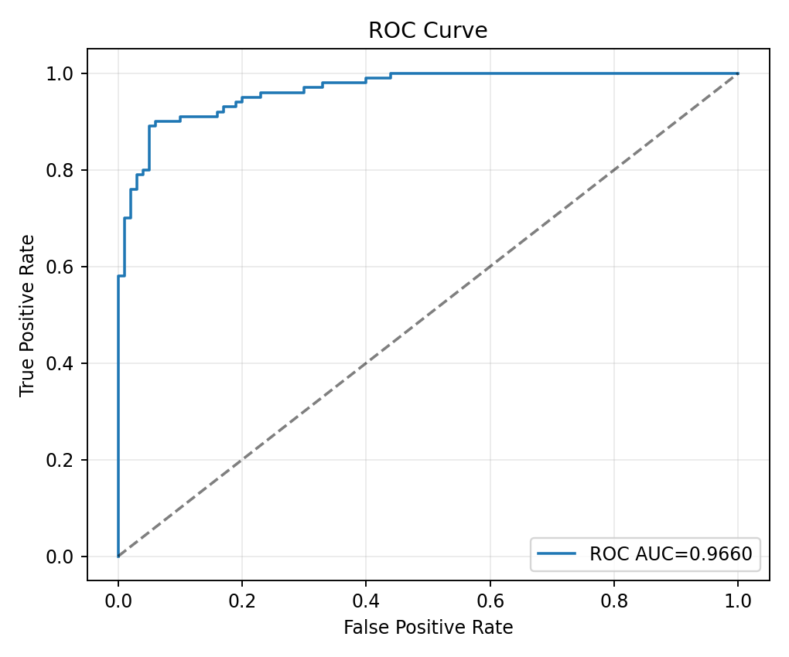
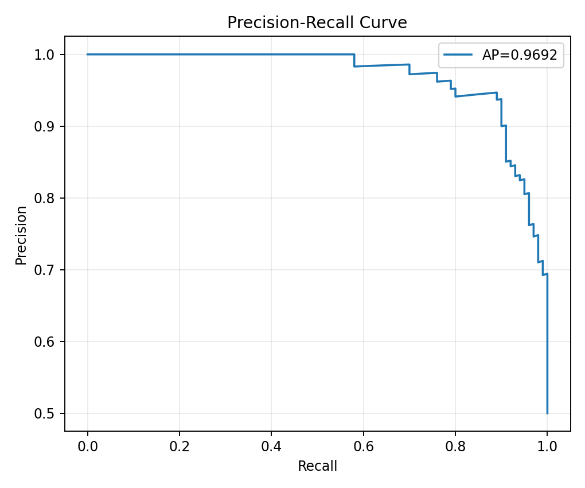
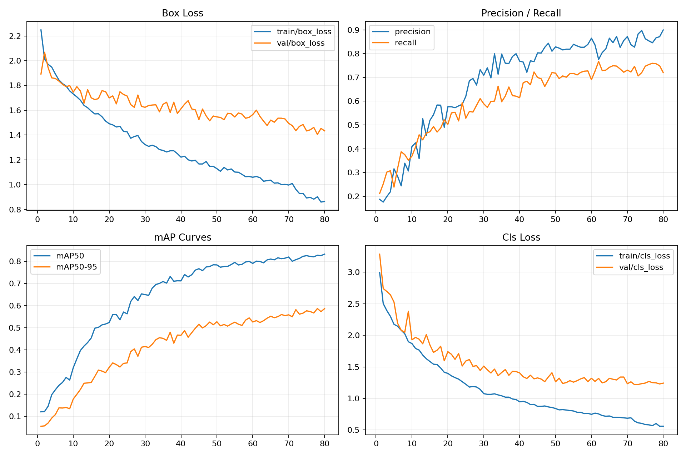
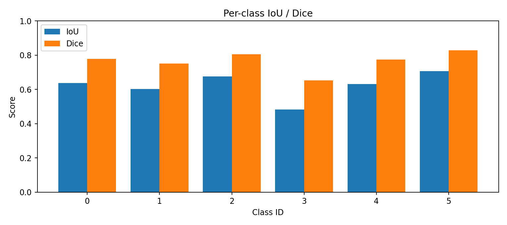
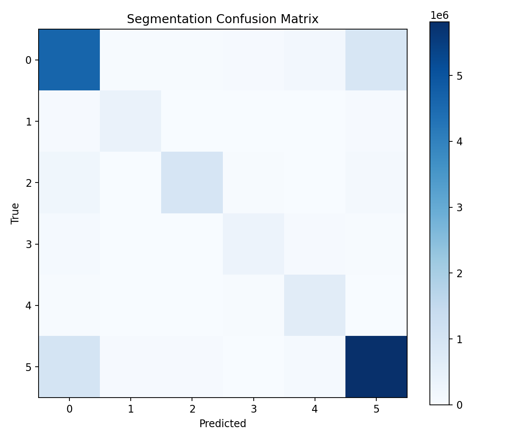

# Metrics and Evaluation

This document consolidates model-quality, operational, and interpretability-relevant metrics for the repository.

## 1) Erosion Model Metrics (XGBoost)

Reference artifact: [artifacts/model_metrics_20260329/xgboost_erosion/metrics_summary.json](./artifacts/model_metrics_20260329/xgboost_erosion/metrics_summary.json)

### Holdout Evaluation (80/20 split)

| Metric | Value |
| --- | ---: |
| Accuracy | 0.9050 |
| Precision | 0.9091 |
| Recall | 0.9000 |
| F1-score | 0.9045 |
| ROC-AUC | 0.9660 |
| Average Precision | 0.9692 |
| RMSE (probability vs label) | 0.2721 |
| R2 (probability vs label) | 0.7038 |
| MAE | 0.1366 |
| MSE | 0.0740 |

### Confusion Matrix

| True \ Pred | 0 | 1 |
| --- | ---: | ---: |
| 0 | 91 | 9 |
| 1 | 10 | 90 |

Supporting files:

- [artifacts/model_metrics_20260329/xgboost_erosion/confusion_matrix_eval.png](./artifacts/model_metrics_20260329/xgboost_erosion/confusion_matrix_eval.png)
- [artifacts/model_metrics_20260329/xgboost_erosion/roc_curve_eval.png](./artifacts/model_metrics_20260329/xgboost_erosion/roc_curve_eval.png)
- [artifacts/model_metrics_20260329/xgboost_erosion/pr_curve_eval.png](./artifacts/model_metrics_20260329/xgboost_erosion/pr_curve_eval.png)

## 2) Cross Validation (XGBoost)

5-fold Stratified CV on [terrain_model/erosion_dataset.csv](./terrain_model/erosion_dataset.csv) with model config from [terrain_model/train_xgboost.py](./terrain_model/train_xgboost.py).

| Fold | Accuracy | F1 | ROC-AUC |
| --- | ---: | ---: | ---: |
| 1 | 0.8700 | 0.8725 | 0.9487 |
| 2 | 0.9050 | 0.9045 | 0.9689 |
| 3 | 0.9150 | 0.9128 | 0.9763 |
| 4 | 0.8550 | 0.8557 | 0.9423 |
| 5 | 0.8650 | 0.8615 | 0.9577 |
| Mean | 0.8820 | 0.8814 | 0.9588 |

## 3) Detection Model Metrics

### YOLOv8s ([runs/detect/yolov8s_archaeology2](./runs/detect/yolov8s_archaeology2))

| Metric | Final |
| --- | ---: |
| Precision | 0.8998 |
| Recall | 0.7201 |
| F1 (estimated) | 0.8000 |
| mAP@50 | 0.8321 |
| mAP@50-95 | 0.5861 |
| Best mAP@50-95 | 0.5867 (epoch 78) |

### YOLOv8n ([runs/detect/train2](./runs/detect/train2))

| Metric | Final |
| --- | ---: |
| Precision | 0.6951 |
| Recall | 0.5490 |
| F1 (estimated) | 0.6135 |
| mAP@50 | 0.6218 |
| mAP@50-95 | 0.3861 |
| Best mAP@50-95 | 0.3961 (epoch 49) |

Detection artifacts:

- [artifacts/model_metrics_20260329/yolov8s_archaeology2/raw_artifacts/](./artifacts/model_metrics_20260329/yolov8s_archaeology2/raw_artifacts/)
- [artifacts/model_metrics_20260329/yolov8n_train2/raw_artifacts/](./artifacts/model_metrics_20260329/yolov8n_train2/raw_artifacts/)
- [artifacts/model_metrics_20260329/yolov8s_archaeology2/training_curves_custom.png](./artifacts/model_metrics_20260329/yolov8s_archaeology2/training_curves_custom.png)

## 4) Segmentation Metrics (DeepLabV3+)

Reference artifact: [artifacts/model_metrics_20260329/deeplabv3plus_segmentation/metrics_summary.json](./artifacts/model_metrics_20260329/deeplabv3plus_segmentation/metrics_summary.json)

Evaluation split: [seg_dataset/valid](./seg_dataset/valid) (61 images)

| Metric | Value |
| --- | ---: |
| Pixel Accuracy | 0.7975 |
| Macro IoU | 0.6229 |
| Macro Dice | 0.7652 |

Per-class scores are available in:

- [artifacts/model_metrics_20260329/deeplabv3plus_segmentation/segmentation_per_class_scores.png](./artifacts/model_metrics_20260329/deeplabv3plus_segmentation/segmentation_per_class_scores.png)
- [artifacts/model_metrics_20260329/deeplabv3plus_segmentation/segmentation_confusion_matrix.png](./artifacts/model_metrics_20260329/deeplabv3plus_segmentation/segmentation_confusion_matrix.png)

## 5) Operational Metrics Snapshot

| Model | Size (MB) | CPU Latency (ms) | Throughput (FPS) |
| --- | ---: | ---: | ---: |
| YOLOv8s trained | 21.4823 | 206.248 | 4.849 |
| YOLOv8n trained | 5.9618 | 80.138 | 12.478 |
| DeepLabV3+ | 85.7716 | 413.138 | 2.421 |
| XGBoost erosion | 0.4968 | 2.0813 | 480.469 |

## 6) Interpretation Guide

### Classification metrics

- Accuracy: Overall correctness. Good for balanced datasets.
- Precision: Of predicted positives, how many are truly positive.
- Recall: Of true positives, how many are found.
- F1-score: Harmonic mean of precision and recall; useful when both matter.
- ROC-AUC: Threshold-independent separability quality.

### Detection metrics

- mAP@50: Detection quality at IoU threshold 0.50.
- mAP@50-95: Stricter, averaged over IoU thresholds 0.50 to 0.95.

### Segmentation metrics

- IoU: Overlap ratio between predicted and true masks.
- Dice: Similarity metric emphasizing overlap, often more intuitive in medical/CV segmentation contexts.

### Regression-style metrics on probabilities

- RMSE/MSE/MAE/R2 on probability-vs-label values indicate calibration and probability fit quality for the erosion classifier.

## 7) Where to Find Raw Production Artifacts

- Root index: [artifacts/model_metrics_20260329/index.json](./artifacts/model_metrics_20260329/index.json)
- Human-readable index: [artifacts/model_metrics_20260329/README.md](./artifacts/model_metrics_20260329/README.md)
- Per-model reports: [artifacts/model_metrics_20260329/<model_name>/metrics_report.md](./artifacts/model_metrics_20260329/)
- Machine-readable summaries: [artifacts/model_metrics_20260329/<model_name>/metrics_summary.json](./artifacts/model_metrics_20260329/)
