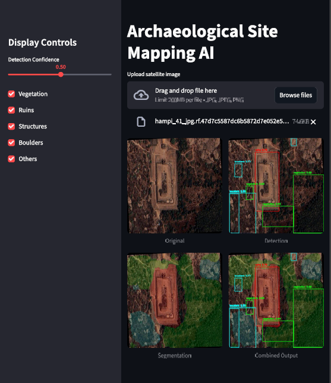
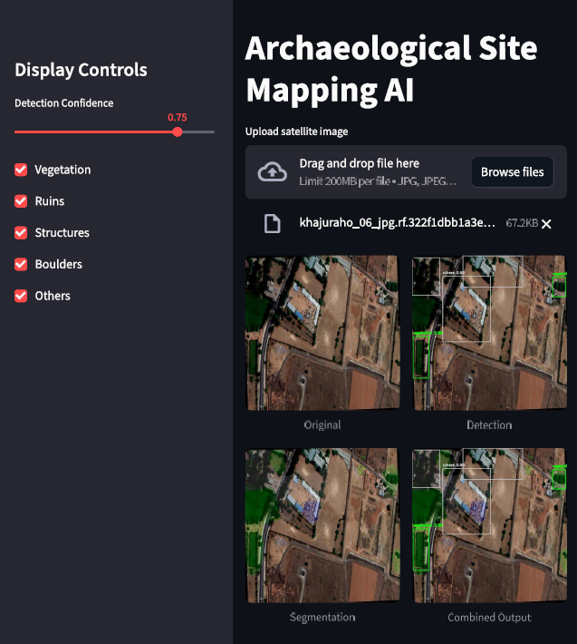
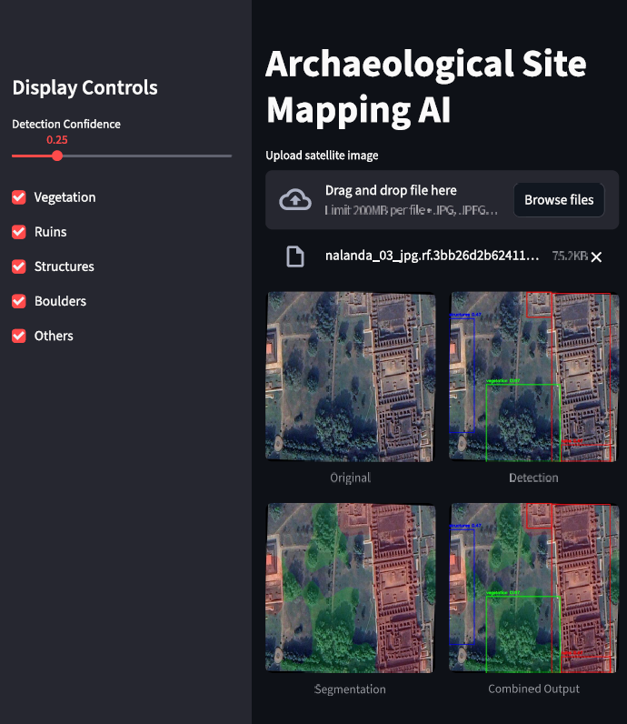
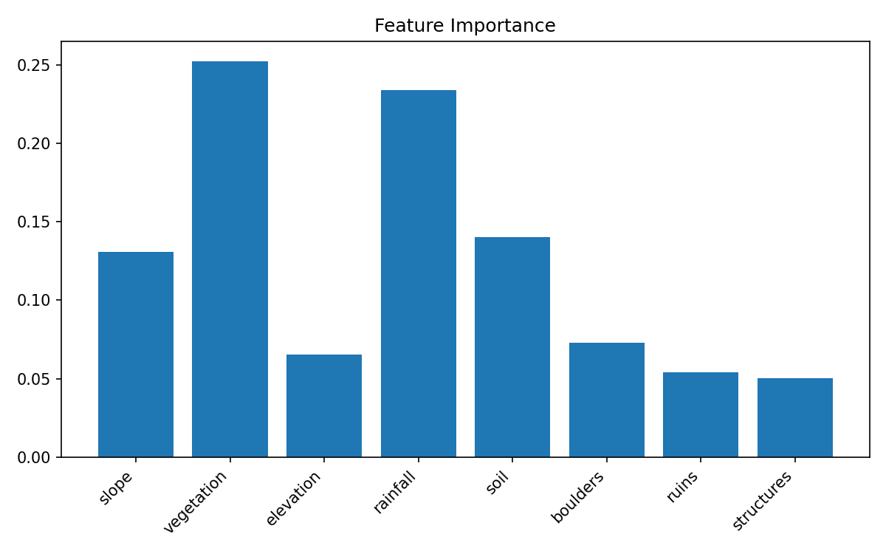

# Archaeological Site Mapping AI - Technical Report (Updated)

## 1. Project Overview

This project is a multi-model AI system for archaeological landscape analysis from aerial/satellite images.

Core pipeline:

Input image -> YOLO detection -> DeepLabV3+ segmentation -> geospatial + terrain feature extraction -> XGBoost erosion risk -> SHAP explanation -> UI/PDF outputs

The repository now supports two runtime interfaces:

- Streamlit app (`app.py`) for Python-native interaction.
- Next.js app (`geo-ai-ui`) with a Node API route that calls a Python worker process.

## 2. Major New Updates

### 2.1 New Web Interface Stack (`geo-ai-ui`)

The project now includes a modern web frontend built with:

- Next.js 14 + React 18 + TypeScript
- Tailwind CSS
- Leaflet + React-Leaflet map picker
- jsPDF report export

Key UI capabilities added:

- Image upload with preview
- EXIF GPS auto-read (`exifr`) when available
- Interactive map click/search coordinate selection
- Per-class visibility controls for detection overlays
- Confidence threshold control
- Optional custom GROQ API key entry
- Optional AI insight toggle
- Local run-history persistence in browser (`localStorage`)
- Direct PDF report generation from UI

### 2.2 Node-to-Python Inference Bridge

The new API route (`geo-ai-ui/app/api/predict/route.ts`) now:

- Accepts multipart upload + coordinates + model/UI controls
- Spawns/communicates with a Python worker (`geo-ai-ui/server/predict_worker.py`)
- Sends JSON jobs via stdin/stdout
- Returns structured JSON with risk score, metrics, SHAP contributions, and output images

### 2.3 Unified Predict Bridge Logic

The inference orchestration in `geo-ai-ui/server/predict_bridge.py` now provides:

- YOLOv8s detection rendering
- DeepLabV3+ segmentation and overlays
- Risk heatmap composition
- Terrain feature extraction via geospatial APIs
- Flexible erosion feature-vector construction based on `n_features_in_`
- SHAP top-feature extraction
- AI explanation routing via GROQ + fallback/default mode

## 3. Models Used

### 3.1 Detection

- Primary: YOLOv8s
  - Base: `yolov8s.pt`
  - Deployed weights: `runs/detect/yolov8s_archaeology2/weights/best.pt`
  - Training script: `train_seg.py`

- Alternate baseline: YOLOv8n
  - Run directory: `runs/detect/train2`

### 3.2 Segmentation

- Model: DeepLabV3+ (segmentation-models-pytorch)
- Encoder: ResNet34
- Classes: 6
- Active weights used for inference: `deeplab_model.pth`
- Best-checkpoint artifact path used by new trainer: `runs/segmentation/deeplab_model_best.pth`
- Training script: `train_deeplab_seg.py`

### 3.3 Erosion Risk

- Model: XGBoost binary classifier
- Main artifact used by inference: `erosion_model.pkl`
- Additional artifact path in terrain module: `terrain_model/erosion_model.pkl`

## 4. Data Configuration

### 4.1 Detection Dataset

From `data.yaml`:

- Train: `dataset/train/images`
- Validation: `dataset/valid/images`
- Test: `dataset/test/images`

Classes:

1. boulders
2. others
3. ruins
4. structures
5. vegetation

### 4.2 Segmentation Dataset

- Path: `seg_dataset`
- Masks generated from COCO via `generate_masks.py`
- Classes:
  - 0 background
  - 1 boulders
  - 2 others
  - 3 ruins
  - 4 structures
  - 5 vegetation

### 4.3 Terrain Dataset

- Source CSV: `terrain_model/erosion_dataset.csv`
- Canonical training schema used in `terrain_model/train_xgboost.py`:
  - `slope, vegetation, elevation, rainfall, soil, boulders, ruins, structures, erosion`

## 5. Training Configuration Snapshot

### 5.1 YOLOv8s (`runs/detect/yolov8s_archaeology2`)

- Epochs: 80
- Image size: 640
- Batch size: 8
- Workers: 8

### 5.2 YOLOv8n (`runs/detect/train2`)

- Epochs: 50
- Image size: 640
- Batch size: 8

### 5.3 DeepLabV3+ (latest trainer)

From `train_deeplab_seg.py` (updated):

- Default epochs: 80
- Image size: 512
- Optimizer: AdamW
- LR default: 3e-4
- Weight decay: 1e-4
- Loss blend: 0.6 CrossEntropy + 0.4 Soft Dice
- Scheduler: ReduceLROnPlateau
- Early stopping: enabled (patience configurable)

### 5.4 XGBoost Terrain Training

From `terrain_model/train_xgboost.py`:

- `n_estimators=300`
- `max_depth=5`
- `learning_rate=0.05`
- Stratified 80/20 train-test split

## 6. Verified Results

### 6.1 YOLOv8s Deployed Run (`runs/detect/yolov8s_archaeology2/results.csv`)

Final epoch (80):

- Precision: 0.89978
- Recall: 0.72010
- mAP50: 0.83206
- mAP50-95: 0.58611

Best observed in run:

- Best mAP50-95: 0.58673 (epoch 78)
- Best mAP50: 0.83206 (epoch 80)
- Best Precision: 0.89978 (epoch 80)
- Best Recall: 0.76738 (epoch 62)

### 6.2 YOLOv8n Baseline (`runs/detect/train2/results.csv`)

Final epoch (50):

- Precision: 0.69512
- Recall: 0.54898
- mAP50: 0.62180
- mAP50-95: 0.38606

Conclusion: YOLOv8s remains the correct deployed choice.

### 6.3 Segmentation and Terrain Numeric Artifacts Status

Code-level update:

- `train_deeplab_seg.py` now supports saving:
  - `deeplab_metrics.csv`
  - `deeplab_loss_curve.png`
  - `deeplab_iou_dice_curve.png`
  - `deeplab_per_class_metrics.csv`
- `terrain_model/train_xgboost.py` now supports saving:
  - classification report text
  - confusion matrix image

Current repository snapshot status:

- `runs/segmentation` currently contains `deeplab_model_best.pth`
- Metrics CSV/curves and terrain artifact folder are not present in the checked-in outputs yet
- Therefore, latest committed segmentation/XGBoost numeric summary cannot be quoted from persisted files at this time

## 7. Deployment and Runtime Behavior

The system can now be run via two frontend modes.

### 7.1 Streamlit Mode (`app.py`)

- Python-native full pipeline execution
- Detection, segmentation, risk estimation, explainability, PDF/report path

### 7.2 Next.js Mode (`geo-ai-ui`)

- Browser client -> `/api/predict` -> Python worker -> shared model pipeline
- Returns:
  - risk probability + risk label
  - metrics object
  - SHAP top features
  - generated overlays as Base64 data URLs (original, detection, segmentation, combined, heatmap)
- Supports AI insight mode and fallback/default narrative behavior

Risk thresholds used:

- `< 0.30`: LOW
- `0.30 to < 0.70`: MODERATE
- `>= 0.70`: HIGH

## 8. Available Visual Artifacts

### 8.1 App Screenshots

### 8.2 Detection Run Artifacts

YOLOv8s charts and confusion matrices are available under:

- `runs/detect/yolov8s_archaeology2`

YOLOv8n baseline charts are available under:

- `runs/detect/train2`

### 8.3 Terrain Feature Importance

## 9. Technical Caveats

1. Script naming: `train_seg.py` trains detection, not segmentation.
2. Erosion schema evolution exists across legacy scripts (`erosion` vs `erosion_risk`, ratio naming variations).
3. New persistence logic exists for segmentation/terrain reports, but latest generated metric artifacts are not yet committed.
4. Next.js runtime currently recycles worker per request (safe for dev consistency, can be optimized for throughput in production).

## 10. Recommended Next Steps

1. Execute latest segmentation and terrain training pipelines once and commit generated metric artifacts.
2. Add a single canonical feature-schema contract file for erosion model training/inference.
3. Add experiment/version metadata (date, dataset hash, model hash) beside each weight artifact.
4. Consider persistent worker pooling for Next.js production mode to reduce cold-start overhead.
5. Add CI checks to validate presence/format of required report artifacts before release.
